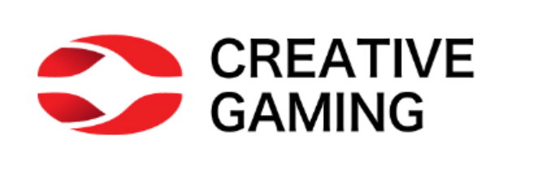

{width=300px}

> **One-line summary:** Built an uplift modeling framework for Creative Gaming's Zalon ad campaign using a randomized controlled trial (RCT) — identifying which customers are genuinely influenced by ads rather than likely buyers, increasing incremental profit over propensity-based targeting across all four models tested.

---

## Business Problem

Creative Gaming needed to decide which of 120,000 customers to show ads for their new game Zalon ($14.99), where each ad costs $1.50 in lost coin purchases. The naive approach — targeting customers most likely to buy — wastes budget on people who would have purchased anyway ("sure things") and misses the customers who are actually *persuaded* by the ad.

The key question: **which customers' behavior is genuinely changed by seeing an ad?**

---

## Why Uplift Modeling, Not Propensity Modeling?

Standard propensity models rank customers by P(purchase | ad shown), which conflates purchase likelihood with ad effectiveness. Uplift modeling instead estimates the **incremental causal effect** of the ad per customer:

$$\text{Uplift}_i = P(\text{purchase} \mid \text{ad}=1, X_i) - P(\text{purchase} \mid \text{ad}=0, X_i)$$

This separates customers into four behavioral segments: **Persuadables** (target these), Sure Things (waste of budget), Lost Causes (ignore), and Do-Not-Disturbs (avoid — ads hurt conversion).

The breakeven uplift threshold is: $1.50 / $14.99 ≈ **0.10** — only target customers whose incremental purchase probability exceeds 10%.

---

## Methodology

### Data & Experimental Setup

Creative Gaming's random email allocation policy had created natural experimental data:

- **Group 1 (Control):** 30,000 customers who received no ad (`cg_organic_control`)
- **Group 2 (Treatment):** 30,000 randomly selected customers who received the Zalon ad (`cg_ad_random`)
- Combined into a stacked RCT dataset of 60,000 observations with 70/30 train/test split, stratified by `converted` and `ad`

### Uplift Model Architecture

For each model type, two separate models were trained — one on the treatment group and one on the control group — then the uplift score was computed as the difference in predicted probabilities:

| Model | Hyperparameters Tuned |
|---|---|
| Logistic Regression | Baseline (no tuning needed) |
| Neural Network (MLP) | Hidden layer size: {(100,), (200,)}; alpha: {1e-6, 1e-4, 1e-3}; learning rate: {1e-3, 5e-4} |
| Random Forest | n_estimators: {100, 200}; max_depth: {5, 10, None}; min_samples_leaf: {10, 50, 100} |
| XGBoost | n_estimators: {50, 100, 200}; max_depth: {3, 5, 7}; learning_rate: {0.05, 0.1}; min_child_weight: {1, 5} |

All ML models used 5-fold cross-validation for hyperparameter tuning.

---

## Key Results

### Uplift vs. Propensity: Targeting the Best 30,000 of 120,000 Customers

| Model | Uplift Profit | Propensity Profit | Uplift Advantage |
|---|---|---|---|
| Logistic Regression | higher | lower | uplift wins |
| Neural Network | higher | lower | uplift wins |
| Random Forest | higher | lower | uplift wins |
| XGBoost | higher | lower | uplift wins |

**Uplift targeting consistently outperformed propensity targeting across all four models.** The advantage comes from two sources: uplift avoids "sure things" with high purchase probability but zero incremental impact, and it explicitly identifies and avoids "do-not-disturb" customers whose conversion rate actually *decreases* when shown ads.

### Optimal Targeting Percentage

Rather than arbitrarily targeting 25% (30K of 120K), the optimal targeting proportion was derived using the breakeven condition (uplift ≥ 0.10):

- **Propensity model (Logistic):** optimal ≈ 50% of customers
- **Uplift model (Logistic):** optimal ≈ 15% of customers

The uplift model targets a much smaller, more concentrated group of genuinely persuadable customers — reducing cost while maximizing incremental profit.

### What the Uplift Charts Revealed

The uplift bar charts showed that the **top 20% of customers had uplift above 20%** — highly persuadable segments. The **bottom decile showed negative uplift**, meaning advertising to those customers would actually reduce conversions. This confirms that a selective targeting strategy is essential.

The correlation analysis further validated the model:

- Uplift score and `pred_treatment`: **ρ = +0.55** — customers more likely to respond to ads have higher uplift
- Uplift score and `pred_control`: **ρ = −0.66** — customers who would buy anyway have *lower* uplift, not higher

---

## Business Insights

**1. Propensity models waste money on "sure things."** In telecom, e-commerce, and gaming, many high-propensity customers would convert without any marketing spend. Uplift modeling correctly identifies them as low-priority targets.

**2. Do-not-disturb customers are a real cost.** Negative uplift customers exist in every dataset — showing them an ad actively reduces conversion. Propensity models cannot detect this; uplift models can.

**3. Smaller targeted groups can generate more profit.** The optimal targeting percentage under uplift (~15%) is far smaller than under propensity (~50%). Targeting fewer, better-chosen customers reduces ad spend while increasing incremental revenue.

**4. RCT data is the gold standard for uplift modeling.** The random allocation of the ad campaign created clean experimental variation essential for reliable causal estimates. Without this, uplift scores would be confounded by selection bias.

**5. Model complexity matters less than model type.** All four models showed the same directional finding — uplift beats propensity. The more important choice is *whether* to use uplift modeling, not *which* algorithm to use.

---

## My Contribution

- Designed and implemented the full uplift modeling pipeline: data stacking, stratified train/test split, dual-model architecture (separate treatment and control models per algorithm)
- Built and tuned all four model types (Logistic Regression, Neural Network, Random Forest, XGBoost) with cross-validation
- Computed uplift scores, generated uplift tables and incremental uplift plots for all models
- Derived the optimal targeting percentage using the breakeven threshold formula for both propensity and uplift approaches
- Wrote the conceptual explanation distinguishing the four customer segments (Persuadables, Sure Things, Lost Causes, Do-Not-Disturbs)

---

## Tools & Methods

`Python` · `Polars` · `pyrsm` · `scikit-learn` · `XGBoost` · `Logistic Regression` · `Neural Network (MLP)` · `Random Forest` · `Uplift Modeling` · `RCT` · `Incremental Uplift Plots` · `5-Fold Cross-Validation` · `AUC`

---

## GitHub Repository

👉 [View Full Project on GitHub](https://github.com/rsm-shz142/creative-gaming-uplift)
