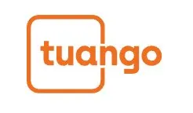

{width=200px}

> **One-line summary:** Applied RFM-based logistic regression to identify which of 397,252 customers should receive a mobile deal offer — model-based selective targeting delivered **¥887,423 profit at 56.6% ROME**, versus only ¥111,713 at 3.1% ROME from mass messaging.

---

## Business Problem

Tuango, a Chinese "deal-of-the-day" platform similar to Groupon, ran a karaoke deal campaign by pushing offer messages through its mobile app. Sending messages has a **hidden cost of 9 RMB per customer** — if a customer receives too many irrelevant offers and blocks future messages, Tuango permanently loses that marketing channel.

After running a test campaign on 20,908 customers, Tuango had 397,252 remaining customers to contact for the rollout. The question: **should all of them receive the message, or only those most likely to buy?**

---

## Methodology

### Data & Setup

- **20,908** test-sample customers used to build and validate the model
- **397,252** rollout customers for actual deployment
- Key features: RFM variables (Recency, Frequency, Monetary), Age, Gender, Music purchase history
- Target variable: whether the customer purchased the karaoke deal (`buyer`)

### Step 1 — Preliminary Analysis

- Overall response rate in the test sample: **~6.2%** of customers purchased
- Among buyers, average order size: **~2.7 sessions** (30-minute karaoke sessions at 49 RMB each)
- Tuango's fee: 50% of revenue → margin per response = 0.5 × 49 RMB × avg order size

### Step 2 — Logistic Regression Model

Built a logistic regression model predicting purchase probability using RFM + demographics:

**Key variable importance findings (Permutation Importance):**

| Variable | Importance | Direction |
|---|---|---|
| Music (prior music purchase) | Highest | ↑ increases purchase probability |
| Gender | High | Female > Other > Male |
| Frequency | Moderate | ↑ more past purchases → more likely to buy |
| Monetary | Moderate | ↑ higher spend → more likely to buy |
| Age | Low-moderate | ↑ older → less likely to buy |
| Recency | Lowest | Less recent → less likely to buy |

### Step 3 — Order Size Model

Built a linear regression on buyers only to predict order size. Finding: **R-squared is very low** — the model explains little variation in order size. This means the RFM variables predict *whether* someone buys well, but not *how much* they buy once they decide to purchase.

### Step 4 — Breakeven Targeting Rule

Calculated the breakeven response rate:

$$\text{Breakeven} = \frac{\text{Cost per message}}{\text{Margin per response}} = \frac{9 \text{ RMB}}{0.5 \times 49 \times \text{avg order size}}$$

Only customers with predicted purchase probability **above this breakeven** received the message.

---

## Key Results

### Projected vs. Realized Performance

|  | Target All | Target by Logit Model |
|---|---|---|
| Messages sent | 397,252 | ~subset only |
| **Profit (RMB)** | **111,713** | **887,423** |
| **ROME** | **3.1%** | **56.6%** |

**Logit-based targeting delivered 8× more profit and 18× better ROME than mass messaging.**

These numbers come from the actual post-rollout data — Tuango contacted all 397,252 customers (to generate evaluation data), allowing a clean comparison of what would have happened under each strategy.

### Why the Model Worked

The test sample response rate was ~6.2%, but the model identified a subset of customers with much higher predicted purchase probability.
By filtering out low-probability customers, the targeting strategy:

- Concentrated messages on customers more likely to buy
- Reduced wasted message costs on unlikely buyers
- Avoided over-messaging customers who would block future notifications

---

## Business Insights

**1. The true cost of a message is not zero.** The 9 RMB marginal cost accounts for the long-term risk of customers blocking deal messages — losing that channel permanently is far more costly than a single wasted send.

**2. RFM variables are highly predictive for deal targeting.** Prior music purchase history and gender were the strongest predictors, suggesting that category affinity and demographics drive deal responsiveness more than raw usage frequency.

**3. Order size is hard to predict — but that's okay.** The linear regression showed very low R-squared for order size, meaning customers who buy tend to buy similar amounts regardless of their profile. The key lever is correctly predicting *who* buys, not *how much* they buy.

**4. Mass messaging is a losing strategy at scale.** A 3.1% ROME means the campaign barely broke even. At 397,252 customers, the difference between selective and mass targeting was ¥775,710 in additional profit — from the same customer base.

**5. Model validation on actual rollout data confirms no overfitting.** The realized post-rollout profit and ROME figures matched the projected direction from the test sample, confirming that the logistic regression generalized well to new customers.

---

## My Contribution

- Conducted preliminary analysis: calculated response rate, average order size, and breakeven threshold
- Built and interpreted the logistic regression model including Permutation Importance and Partial Dependence Plots for all variables
- Built the order size linear regression and explained why low R-squared is expected in this context
- Derived the breakeven response rate and implemented the targeting decision rule
- Calculated projected and actual profit and ROME for both strategies; created comparison bar charts
- Evaluated post-rollout realized performance and confirmed model generalization

---

## Tools & Methods

`Python` · `Polars` · `pyrsm` · `plotnine` · `Logistic Regression` · `Linear Regression` · `RFM Analysis` · `Permutation Importance` · `Partial Dependence Plots` · `Test-and-Rollout Design` · `ROME`

---

## GitHub Repository

👉 [View Full Project on GitHub](https://github.com/rsm-shz142/tuango-mobile-targeting)
